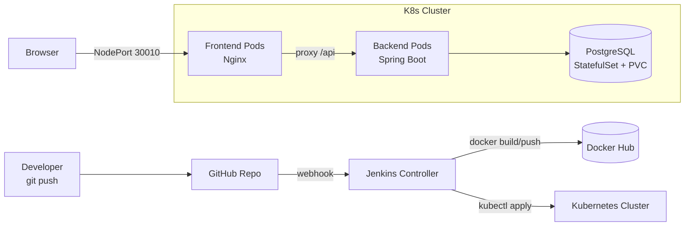

# Notes App — Kubernetes + Jenkins CI/CD Pipeline

A 3-tier web application (Nginx frontend, Spring Boot backend, PostgreSQL database) deployed on a self-managed Kubernetes cluster, with a fully automated CI/CD pipeline: every push to `main` builds new Docker images, pushes them to Docker Hub, and rolls out the update across the cluster — with zero manual steps.

## Architecture



## Stack

| Layer | Technology |
|---|---|
| Frontend | Nginx serving static HTML/JS, reverse-proxies `/api/*` to backend |
| Backend | Java 21, Spring Boot, Spring Data JPA |
| Database | PostgreSQL 16, deployed as a StatefulSet with a PersistentVolumeClaim |
| Container Registry | Docker Hub |
| Orchestration | Kubernetes (kubeadm, self-managed, Calico CNI) |
| CI/CD | Jenkins (declarative pipeline), triggered by GitHub webhooks |
| Infrastructure Provisioning | Terraform (EC2, VPC, security groups) |
| Configuration Management | Ansible (Jenkins install, Kubernetes cluster bootstrap) |

## How the pipeline works

1. A push to `main` fires a GitHub webhook to Jenkins.
2. **Checkout stage** clones the repo.
3. **Build & Push stage** (runs on the Jenkins controller, which has Docker) builds the frontend and backend images, tags them with the build number, and pushes both to Docker Hub.
4. **Deploy stage** (runs on the Kubernetes master, registered as a Jenkins agent) applies the Kubernetes manifests and updates the Deployments to the new image tag, triggering a rolling update with zero downtime.

## Kubernetes design choices

- **StatefulSet + PVC for Postgres** rather than a plain Deployment, so the database keeps stable identity and storage across pod restarts.
- **Headless Service for Postgres**, ClusterIP for the backend (internal-only), NodePort for the frontend (the only externally reachable component).
- **Nginx reverse proxy in the frontend pod** — the browser only ever talks to Nginx on NodePort 30010; Nginx forwards `/api/*` calls to the backend's ClusterIP internally. This avoids exposing the backend outside the cluster at all.

## Problems solved along the way

Real infrastructure work rarely goes smoothly on the first try — a few of the actual issues hit and fixed while building this:

- **Expired GPG signing key** — Jenkins rotated its Debian repo signing key; the old key had expired, causing `NO_PUBKEY` errors on `apt update`. Fixed by switching to the current key and repository path.
- **Jenkins wouldn't start** — `journalctl` showed Jenkins now requires Java 21 minimum; the box had Java 17 installed. Fixed by installing OpenJDK 21 and setting it as the default via `update-alternatives`.
- **`kubeadm join` timing out** — the worker node couldn't reach the control plane's API server on port 6443. Root cause was a missing inbound security group rule between cluster nodes; fixed with a self-referencing security group rule allowing all traffic between nodes in the cluster.
- **Jenkins SSH agent failing with exit code 127** — `java: command not found` on the target node; the Kubernetes master had no JDK installed before being added as a Jenkins agent.
- **GitHub webhook returning HTTP 403** — Jenkins' default security config blocks anonymous requests, which is how GitHub's webhook calls in. Fixed by enabling anonymous read access under Jenkins' global security settings.

## Repository structure

```
.
├── backend/            Spring Boot REST API (Note entity, repository, controller)
├── frontend/            Static page + Nginx reverse-proxy config
├── k8s/                  Kubernetes manifests (Postgres StatefulSet, Deployments, Services, Secret)
└── Jenkinsfile           Declarative pipeline: build, push, deploy
```

## Running it yourself

1. Provision 3 hosts (Jenkins controller, Kubernetes master, Kubernetes worker) — Terraform configs available on request.
2. Bootstrap Jenkins and the Kubernetes cluster via Ansible.
3. Register the Kubernetes master as a Jenkins agent (SSH launcher).
4. Add Docker Hub credentials in Jenkins (`dockerhub-creds`).
5. Create a Jenkins Pipeline job pointing at this repo, script path `Jenkinsfile`.
6. Add a default StorageClass to the cluster for the Postgres PVC, e.g. [local-path-provisioner](https://github.com/rancher/local-path-provisioner).
7. Push to `main` — the pipeline handles the rest.

## License

MIT
